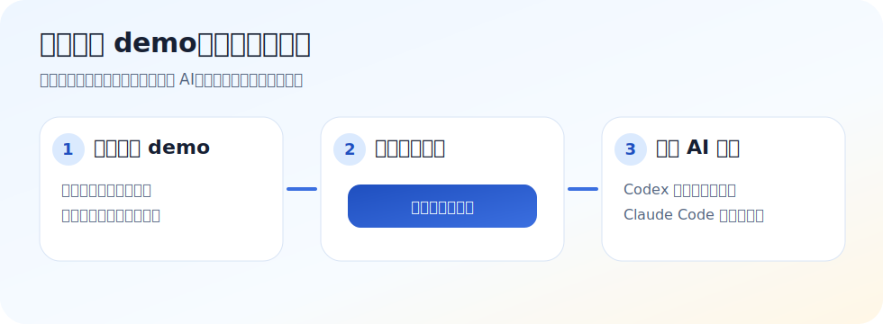
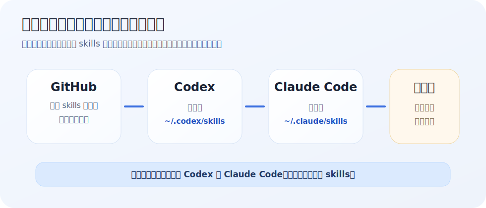

# 二刀流開發助手控制台

這是一個給 **Codex + Claude Code** 使用的提示詞與 skills 小工具。  
你可以先用線上版試玩，也可以安裝到自己的電腦，變成本機控制台。

線上試用版 demo：<https://kagenhsu.github.io/codex-claude-skills-backup/>



## 先看這裡：這個工具可以幫你做什麼？

如果你剛開始用 AI 寫程式，最常卡住的是：

- 不知道要怎麼跟 Codex 說清楚需求。
- 不知道什麼時候該找 Claude Code 幫忙審查。
- 不知道新專案、修 bug、整理資料時該從哪個提示詞開始。
- 每次都要重新想提示詞，很累，也容易漏掉重要步驟。

這個控制台就是把常用提示詞、二刀流流程、skills 入口整理成一個網頁。  
你只要打開網頁，按下複製按鈕，再貼給 Codex 或 Claude Code 使用。

## 新手建議使用方式

1. 先打開線上 demo 看介面。
2. 找到首頁的「新手先按：複製分工細節說明」。
3. 把複製好的提示詞貼給 AI，先請 AI 解釋 Codex / Claude Code 怎麼分工。
4. 如果覺得會用，再照下面的安裝教學裝到自己的電腦。

線上 demo 可以看介面與複製提示詞。  
如果你想讀取自己電腦裡的 skills、開本機控制台、保留自己的工作流程，才需要安裝本機版。

## 安裝會發生什麼事？



簡單說，安裝腳本會幫你做這幾件事：

| 動作 | 說明 |
|---|---|
| 下載備份包 | 從 GitHub 下載 `codex-skills-backup.tar.gz` |
| 解壓縮 | 把壓縮包展開到暫存資料夾 |
| 安裝 Codex skills | 複製到 `~/.codex/skills` |
| 安裝 Claude Code skills | 複製到 `~/.claude/skills` |
| 安裝本機控制台 | 複製或下載 `index.html` 到使用者文件資料夾 |
| 建立桌面入口 | Windows 建立捷徑，macOS 建立 `.command` |
| 保護既有資料 | 如果同名 skill 已存在，會跳過，不會直接覆蓋 |

它不是安裝大型軟體，也不會替你設定 API key。  
它主要是把整理好的 skills 和控制台放到 Codex / Claude Code 會讀取的位置。

## 一行安裝

如果你只是想最快安裝，可以複製下面對應你電腦系統的指令。

### Windows PowerShell

1. 打開 Windows 的 PowerShell。
2. 貼上下面這行。
3. 按 Enter 執行。

```powershell
powershell -ExecutionPolicy Bypass -NoProfile -Command "irm https://raw.githubusercontent.com/kagenhsu/codex-claude-skills-backup/main/install.ps1 | iex"
```

### macOS

1. 打開 Terminal。
2. 貼上下面這行。
3. 按 Enter 執行。

```bash
curl -fsSL https://raw.githubusercontent.com/kagenhsu/codex-claude-skills-backup/main/install.sh | bash
```

安裝完成後，請重新啟動 Codex 和 Claude Code。

Windows 會在桌面建立 `二刀流開發助手控制台` 捷徑。  
macOS 會在桌面建立 `二刀流開發助手控制台.command`。

## 比較安全的安裝方式

如果你不想直接執行網路上的腳本，可以先下載，打開看過內容，再執行。

### Windows PowerShell

```powershell
irm https://raw.githubusercontent.com/kagenhsu/codex-claude-skills-backup/main/install.ps1 -OutFile install.ps1
notepad install.ps1
powershell -ExecutionPolicy Bypass -File .\install.ps1
```

### macOS

```bash
curl -fsSLO https://raw.githubusercontent.com/kagenhsu/codex-claude-skills-backup/main/install.sh
less install.sh
bash install.sh
```

## 安裝後怎麼打開？

### Windows

請到桌面找：

```text
二刀流開發助手控制台
```

雙擊打開即可。

### macOS

請到桌面找：

```text
二刀流開發助手控制台.command
```

雙擊打開即可。

如果第一次雙擊出現「來自無法識別的開發者」或「已損毀」，可以用其中一種方式處理：

- 在 Finder 對檔案按右鍵，選擇「打開」。
- 在 Terminal 執行 `xattr -d com.apple.quarantine 更新並開啟控制台.command`。

如果你是下載整個 repo，也可以直接雙擊：

```text
index.html
```

`index.html` 是本機 HTML 單頁控制台，可以查 skills、複製提示詞、看二刀流工作流。

## 適合誰使用？

- 你剛開始用 Codex 或 Claude Code，還不知道怎麼下指令。
- 你想用 Codex 實作，Claude Code 幫忙審查。
- 你常常要整理需求、規劃功能、修 bug、寫 PRD。
- 你想把常用提示詞收在同一個地方，不想每次重打。

## 有問題怎麼辦？

這是一個持續整理中的小工具。  
如果你安裝失敗、按鈕不能用、提示詞看不懂，或有希望新增的功能，可以到 GitHub 留言：

- 用 `Issues` 回報問題：<https://github.com/kagenhsu/codex-claude-skills-backup/issues>
- 也可以在 repo 留下你的使用情境與建議。

作者會不定期整理回饋並改善。  
如果你是新手，留言時可以直接貼上「你做到哪一步、看到什麼畫面、出現什麼錯誤」，不用先判斷是哪裡壞掉。

## 專案內容

- `index.html` - 本機二刀流開發助手控制台，雙擊開啟。
- `codex-skills-backup.tar.gz` - 可攜式 skills 備份包。
- `install.ps1` - Windows 一行安裝腳本。
- `install.sh` - macOS 一行安裝腳本。
- `restore-skills.sh` - macOS 離線還原腳本，適合已經完整下載 repo 的情境。
- `更新並開啟控制台.command` - macOS 用，一鍵更新並打開本機控制台。
- `data/skills.yaml` - 控制台的 skill 目錄資料。
- `data/prompts.yaml` - 控制台的提示詞庫資料。
- `scripts/build.py` - 由 YAML 重建 `index.html`。

## Restore On A New Mac

如果你是換新 Mac，要整包還原，可以使用：

```bash
git clone https://github.com/kagenhsu/codex-claude-skills-backup.git
cd codex-claude-skills-backup
./restore-skills.sh
```

The restore script installs skills into:

```bash
~/.codex/skills
~/.claude/skills
```

Restart Codex and Claude Code after restoring.

## Notes

This backup does not include API keys, Codex config, Claude config, MCP settings, or shell environment variables.

Some skills may require separate setup for Node.js, Bun, API keys, browser automation, or service credentials.
